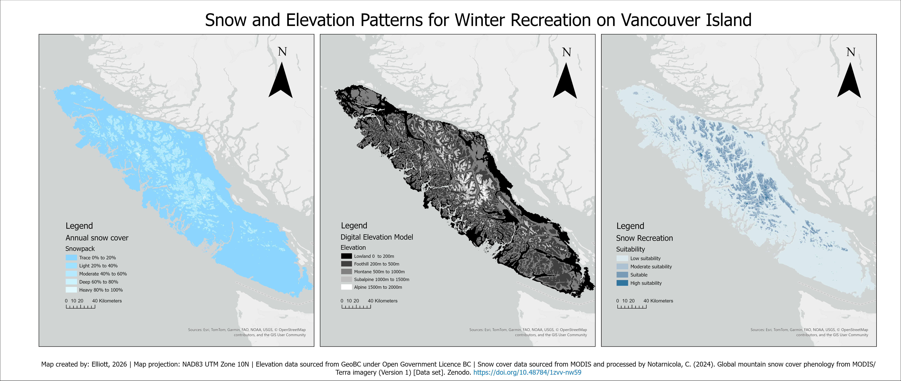

# 🌲 Vancouver Island Suitability Analysis

## 📌 Project Overview
This project evaluates land suitability across Vancouver Island using multiple environmental and geographic criteria. The analysis integrates multiple geospatial datasets to identify areas that meet defined suitability conditions.

The final output is a map visualization created in ArcGIS.

### Suitability Map
